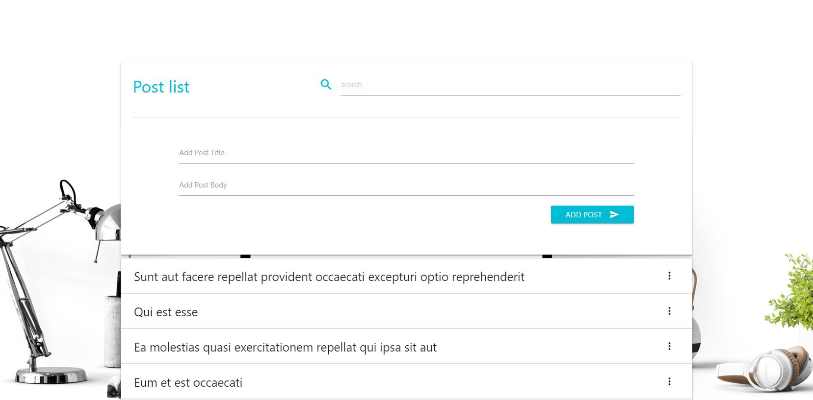

# Post list
> React application created for fetching, listing, deleting and searching posts from [JSONPlaceholder] Fake Online REST API

See a Demo on [POST-LIST].

## Table of contents
* [Screenshots](#screenshots)
* [Technologies](#technologies)
* [Libraries](#libraries)
* [Fake_REST_API](#Fake_REST_API)
* [Images](#Images)
* [Setup](#setup)
* [Features](#features)
* [Contact](#contact)


## Screenshots


## Technologies
* [React] - [version 16.8.6]
* [Axios]- [version 0.19.0]

## Libraries
* Materialize - [version 0.100.2]
* jQuery - [version 3.2.1]

## Fake_REST_API
* [JSONPlaceholder] - [/posts]

## Images
I downloaded an image from [unsplash.com] and a spinner from [loading.io]
You can get a lot of inspiration there.

## Setup
You’ll need to have Node >= 6 and npm >= 5.2 on your machine. 

After you clone the Post list repository, target npm to the root of an application. You need to install all the dependencies with:

```sh
$ npm install
```
Now, you can start the application with

```sh
$ npm run start
```
which will open it on http://localhost:3000/.


## Features

* Post fetching
* Post listing
* Post adding
* Post deleting
* Post searching
* Loading spinner implementation for any service call on posts

To-do list:
* Application testing

## Contact
Created by [Vladimir Karatosic] - feel free to contact me!

You can visit my [GitHub] page and see the rest of my projects.
If you like it, give me the Star. Thanks!

[POST-LIST]:(https://github.com/VladimirKaratosic/post-list)
[Vladimir Karatosic]:(http://vladimirkaratosic.com)
[GitHub]:(https://github.com/VladimirKaratosic)
[React]:(https://reactjs.org/)
[Axios]:(https://www.npmjs.com/package/axios)
[JSONPlaceholder]:(https://jsonplaceholder.typicode.com/)
[/posts]:(https://jsonplaceholder.typicode.com/posts)
[version 16.8.6]:(https://github.com/facebook/react/blob/master/CHANGELOG.md#1680-february-6-2019)
[version 0.19.0]:(https://www.npmjs.com/package/axios/v/0.19.0)
[version 0.100.2]:(http://archives.materializecss.com/0.100.2/)
[version 3.2.1]:(https://code.jquery.com/jquery-3.2.1.min.js)
[unsplash.com]:(https://unsplash.com/)
[loading.io]:(https://loading.io/spinner/)